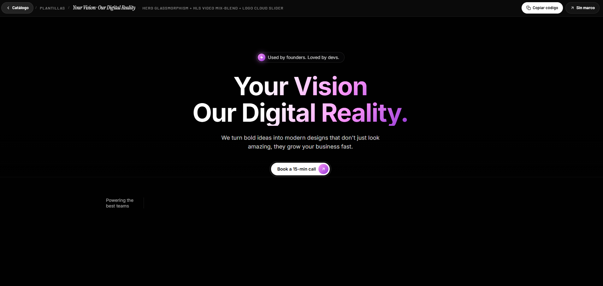

# 25 — Your Vision · Our Digital Reality

Hero **glassmorphism dark** con paleta purple/pink. Pill superior "Used by founders. Loved by devs." con icono Zap en cápsula gradient, **H1 con gradient text clipeado** (blanco→pink→purple), CTA glass pill con flecha. Vídeo **HLS de Cloudflare Stream** con `mix-blend-mode: screen` para fundir los negros del vídeo con el bg de la página, y una sección de **logo cloud con slider infinito** debajo (OpenAI, Nvidia, GitHub, Laravel, etc. invertidos en blanco).

## 🖼️ Preview



## 🧱 Tecnologías

Vía **CDN**, sin build step. Adaptación de la spec original (React + Vite + Tailwind v4 + motion/react + hls.js) al formato del catálogo.

- **Tailwind CSS** (CDN runtime)
- **React 18.3.1** (UMD dev)
- **Babel Standalone 7.29.0**
- **Framer Motion 11.11.17** (UMD, cargada pero no usada para animaciones en este draft)
- **hls.js 1.5.15** para el stream Cloudflare
- **Google Fonts**: Inter (400/500/600/700/800)

## 🎨 Sistema de diseño

- **Background**: `#010101` casi negro puro.
- **Primary gradient** (pink→purple): `linear-gradient(135deg, #FA93FA 0%, #C967E8 50%, #983AD6 100%)`. Usado en:
  - Cápsula gradient del icono Zap (pill superior)
  - Cápsula gradient del icono ArrowUpRight (CTA hero)
  - Stops finales del gradient del H1 (texto)
- **Glass tokens**:
  - Pill bg: `rgba(28, 27, 36, 0.15)` + border `rgba(255,255,255,0.10)` + `backdrop-filter: blur(8px)`.
  - CTA outer wrapper: `bg-white/5 + border-white/10 + backdrop-blur`.
- **Texto secundario**: `text-white/80`, `text-white/60`.

## 🎯 Componentes destacados

### Announcement Pill
Inline pill `pl-1 pr-4 py-1 rounded-full` con:
- Cápsula `w-6 h-6 rounded-full` interior gradient con icono **Zap** lucide (blanco)
- Shadow glow `0 0 16px 2px rgba(201, 103, 232, 0.5)`
- Texto "Used by founders. Loved by devs." en `text-white/80`

### H1 Gradient Text
Dos líneas (`block`), cada una con su propio gradient:
```css
background: linear-gradient(135deg, #fff 0%, #fff 35%, #FA93FA 70%, #983AD6 100%);
-webkit-background-clip: text;
-webkit-text-fill-color: transparent;
```
Resultado: blanco en la parte alta-izquierda que se desvanece hacia pink/purple en la parte baja-derecha.

### Hero Video con mix-blend
- Stream HLS Cloudflare a través de hls.js.
- Contenedor con `margin-top: -150px` → el vídeo **se superpone detrás del texto** (text z-20, video z-10).
- `mix-blend-mode: screen` → los píxeles negros del vídeo desaparecen, dejando ver el bg `#010101`. Solo los píxeles de luz quedan visibles.
- Overlay gradient `linear-gradient(to bottom, #010101, transparent, #010101)` para fundir los bordes superior/inferior del vídeo con la página.

### Infinite Slider (logo cloud)
- 8 brand logos duplicados = 16 elementos para loop seamless.
- Animación CSS keyframes `0% { translateX(0%) } → 100% { translateX(-50%) }` (correcto por la duplicación).
- Filter `brightness(0) invert(1)` convierte los SVG originalmente coloreados en versiones blancas.
- Layout: izquierda *"Powering the best teams"* + divider vertical + slider derecha (en mobile se apila).

## 🧩 Estructura

```
<main bg-#010101>
  └─ <Hero>
       ├─ z-20: pill + H1 gradient + subtitle + CTA glass
       └─ z-10: video HLS (mix-blend-screen, -mt-150) + gradient overlay
  └─ <LogoCloud>
       ├─ "Powering the best teams" + divider
       └─ InfiniteSlider con 16 logos invertidos
```

## ▶️ Cómo usarla

1. Abrir `index.html` directamente o vía el viewer del catálogo.
2. Sin `npm install`, sin build.
3. Stream HLS de **Cloudflare Stream** — si cae, hay que sustituir `HLS_SRC` (el spec mencionaba un fallback MP4 local, no incluido en esta versión CDN).

## 📝 Notas / Pendientes

- [x] Añadir `preview.png` (Captura de pantalla 2026-05-14 143647 — vista desde el viewer del catálogo mostrando el hero glassmorphism completo: pill superior, H1 con gradient blanco→purple/pink, subtítulo, CTA glass con cápsula gradient y comienzo del logo cloud bajo)
- [ ] El stream HLS de Cloudflare creó correctamente el blob URL via MediaSource (verificado), pero `video.readyState=0` los primeros 2-3 segundos hasta que descarga el primer segmento. En pestañas backgrounded puede no llegar a parsear el manifest.
- [ ] El fallback MP4 `/_videos/v1/...` del spec original no se implementa porque es un path local que no existe en este formato CDN. Si HLS falla irrecoverablemente, el vídeo simplemente queda en negro y `mix-blend-screen` lo hace invisible.
- [ ] Framer Motion está cargada (window.Motion) pero no se usa para animaciones en este draft — el InfiniteSlider usa CSS keyframes en su lugar.
